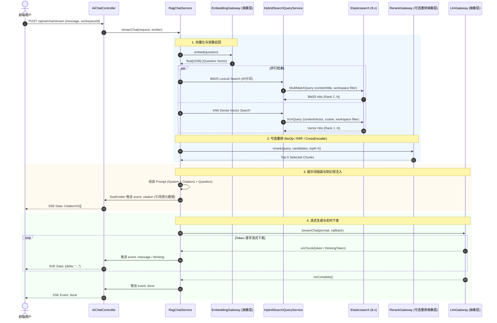

# 阶段四：AI 智能问答与 RAG 检索增强中心（任务实施全景清单）

> **所属项目**：KnowFlow 知识库管理系统  
> **模块定位**：**AI 智能中枢与 RAG 检索增强中心（AI Intelligence & RAG Center）**  
> **架构技术规范**：JDK 25 + Spring Boot 4.x + Spring Modulith + Spring Data JPA + Spring Data Elasticsearch (Dense Vector) + CQRS + SSE (Server-Sent Events) + MapStruct + ACL 防腐层 + 充血模型  
> **阶段时间范围（参考）**：第 14 ~ 20 天  
> **核心规范依从**：严格执行 [AGENTS.md](file:///Users/yujian/Downloads/trade/.agents/rules/AGENTS.md) 架构防线（Controller 纯粹性、不可变 record、无大事务网络 IO、ACL 防腐层隔离、MapStruct 映射）

---

## 一、 阶段二与阶段三已交付成果（阶段四上游基底）

> 阶段四紧密依托阶段二的文档资产状态机和阶段三的 Elasticsearch 检索基础设施，完全复用已有底座，杜绝重复造轮子：

| 已完成模块 | 关键类 / 资产 | 阶段四直接复用点 |
|:---|:---|:---|
| **文档领域实体** | [`DocumentEntity`](file:///Users/yujian/Downloads/trade/src/main/java/com/knowflow/application/document/model/entity/DocumentEntity.java) / [`DocSourceFileEntity`](file:///Users/yujian/Downloads/trade/src/main/java/com/knowflow/application/document/model/entity/DocSourceFileEntity.java) | 提供正文 Markdown `content` 与原件解析纯文本 `rawText`，作为切块输入源 |
| **状态机流转事件** | [`DocumentStateTransitionEvent`](file:///Users/yujian/Downloads/trade/src/main/java/com/knowflow/application/document/statemachine/DocumentStateTransitionEvent.java) | 监听 `PUBLISHED` 触发异步切块与向量化，监听 `ARCHIVED`/`DRAFT` 触发向量索引物理下线 |
| **ES 8.x 基础设施** | `ElasticsearchTemplate` / [`ElasticsearchProperties`](file:///Users/yujian/Downloads/trade/src/main/java/com/knowflow/application/document/search/ElasticsearchProperties.java) | 原生支持 `dense_vector`（dims=1536，cosine 相似度）与 kNN 向量检索 |
| **安全用户上下文** | [`SecurityHolder`](file:///Users/yujian/Downloads/trade/src/main/java/com/knowflow/application/common/SecurityHolder.java) | 提取当前用户 `userId` 用于权限隔离、对话会话归属与历史追踪 |
| **缓存底座** | `RedisTemplate` | 用于多轮会话窗口暂存（`kf:ai:session:{sessionId}`）与上下文滑动窗口管理 |
| **统一异常体系** | [`ErrorCode`](file:///Users/yujian/Downloads/trade/src/main/java/com/knowflow/application/common/ErrorCode.java) / [`BusinessException`](file:///Users/yujian/Downloads/trade/src/main/java/com/knowflow/application/exception/BusinessException.java) | 扩展 AI 分组错误码（LLM 调用异常、向量化失败、切块异常等） |

---

## 二、 阶段四业务全景与架构设计

### 2.1 整体数据流向全景图

```
【离线切块与向量入库链路】
DocumentStateTransitionEvent(PUBLISHED)
       │
       ▼ [Async EventListener] DocVectorSyncListener
       ├─ 获取文档正文 content / rawText
       ├─ [RecursiveTextSplitter] 递归语义切块 (500 Token, 50 Overlap, 附加层级上下文)
       ├─ [EmbeddingGateway 抽象层] 批量文本向量化 (Text -> float[1536])
       └─ [DocChunkRepository] 保存切块至 ES knowflow_chunk_index (BM25 + dense_vector)

【在线 RAG 检索增强对话链路】
前端用户提问 (POST /api/ai/chat/stream)
       │
       ▼ AiChatController (参数校验，无事务)
       ▼ RagChatService (用例编排)
       ├─ [EmbeddingGateway 抽象层] 计算 Question 向量 (float[1536])
       ├─ [HybridSearchQueryService] 双路召回 (ES 8.x):
       │   ├─ 路径 1: BM25 词法关键词召回 (content, title, tags)
       │   └─ 路径 2: kNN 向量语义相似度召回 (cosine 距离)
       ├─ [RerankGateway 抽象层 (可选重排)]:
       │   ├─ 若 enabled=false / NONE: 直接并集打分截断 (零额外开销)
       │   ├─ 若 strategy=RRF: 纯数学倒数排名融合算法 (无外部依赖)
       │   └─ 若 strategy=CROSS_ENCODER: 深度学习模型重排 (BGE-Reranker/DashScope/Cohere)
       ├─ [CitationBuilder] 组装结构化引用溯源数组 (List<CitationVO>)
       ├─ [RagPromptTemplate] 组装防幻觉 Prompt (System Prompt + Reference Chunks + Question)
       ├─ [LlmGateway 抽象层] 调用 LLM 流式输出 (DeepSeek-V3 / R1 / Qwen / Ollama)
       └─ [SSE 流式推送信道] -> 实时将思考过程、文本 Token 与 Citation 数组推送前端
```

### 2.2 前端分离原则（PRD 指导原则依从）

> **PRD 核心原则**：“把可以留给前端的计算逻辑不要在后端做（这部分留给前端并未实现的要标记一下），优先白嫖用户 CPU，特别繁重的不要在前端。”

- **后端职责（纯粹数据与智能层）**：
  1. 负责精确的语义切块、向量化、双路混合检索与可选 Rerank 打分；
  2. 负责组装带有防幻觉边界的专业 Prompt；
  3. 负责向前端提供结构化的 SSE 事件流：
     - `event: thinking`：推送深度推理模型的思考过程 Token（针对 DeepSeek-R1）；
     - `event: message`：推送核心回答的正文 Token 增量；
     - `event: citation`：在回答结束前推送结构化引用源数据（包含 `docId`、`docTitle`、`chunkIndex`、`hitSnippet`、`score`）；
     - `event: done`：推送结束标记与总耗时统计。
- **前端职责（白嫖客户端 CPU 渲染，标记供前端落地）**：
  1. [前端待实现] **Markdown 与代码高亮渲染**：使用 `marked` / `markdown-it` + `Prism.js` 客户端渲染；
  2. [前端待实现] **LaTeX 数学公式解析**：使用 `KaTeX` 客户端渲染公式；
  3. [前端待实现] **思考过程折叠组件**：对 `thinking` 流式事件动态呈现 `<details>` 折叠卡片与思考耗时；
  4. [前端待实现] **引用角标交互**：对正文中出现的 `[1]`、`[2]` 角标实现悬浮 Popover 预览与一键点击直达文档详情。

---

## 三、 核心架构防腐层设计（三大抽象层与热插拔）

为了实现生产级可维护性与随技术演进平滑替换模型底座，**大模型、向量化、Rerank 全部设计为高内聚抽象网关（ACL + SPI）**：

```
                    ┌─────────────────────────┐
                    │     业务编排层 (CQRS)     │
                    │      RagChatService     │
                    └────────────┬────────────┘
                                 │
         ┌───────────────────────┼───────────────────────┐
         ▼                       ▼                       ▼
┌──────────────────┐    ┌──────────────────┐    ┌──────────────────┐
│   LlmGateway     │    │ EmbeddingGateway │    │  RerankGateway   │
│   (大模型抽象层)   │    │  (向量化抽象层)   │    │ (重排抽象层-可选) │
└────────┬─────────┘    └────────┬─────────┘    └────────┬─────────┘
         │ SPI                   │ SPI                   │ SPI
  ┌──────┴──────┐         ┌──────┴──────┐         ┌──────┴──────┐
  ├─ DeepSeek   │         ├─ OpenAI-Comp│         ├─ NoOp (关闭)│
  ├─ Qwen       │         ├─ Ollama     │         ├─ RRF (纯算法)
  ├─ Ollama     │         └─ Mock       │         ├─ CrossEncode│
  └─ Mock       │                                 └─ Mock       │
```

### 3.1 大模型抽象层：`LlmGateway`
- **设计目标**：统一流式与非流式调用契约，屏蔽不同大模型厂商协议差异。
- **统一接口契约**：
  ```java
  public interface LlmGateway {
      AiChatResponse chat(LlmChatCommand command);
      void streamChat(LlmChatCommand command, LlmStreamCallback callback);
  }
  ```
- **SPI 适配器矩阵**：
  - `DeepSeekLlmAdapter`：适配 DeepSeek-V3 / DeepSeek-R1（解析 `reasoning_content` 思维链）；
  - `QwenLlmAdapter`：适配阿里通义千问（DashScope API）；
  - `OllamaLlmAdapter`：适配本地私有化部署模型（如 `qwen2.5:7b`、`deepseek-r1:8b`）；
  - `MockLlmAdapter`：测试与断网降级桩，零外部依赖保障单元测试与离线演示。

### 3.2 向量化抽象层：`EmbeddingGateway`
- **设计目标**：统一文本向量计算，支持单句与高效批量分批向量化。
- **统一接口契约**：
  ```java
  public interface EmbeddingGateway {
      float[] embed(String text);
      List<float[]> embedBatch(List<String> texts);
      int getDimension();
  }
  ```
- **SPI 适配器矩阵**：
  - `OpenAiCompatibleEmbeddingAdapter`：适配 OpenAI、DashScope `text-embedding-v3` 等标准协议；
  - `OllamaEmbeddingAdapter`：适配本地 Ollama 嵌入模型（如 `bge-m3`, `nomic-embed-text`）；
  - `MockEmbeddingAdapter`：基于文本内容哈希生成的伪随机归一化单位向量，1536 维，测试开箱即用。

### 3.3 重排抽象层：`RerankGateway`（必须设计为可选与可插拔）
- **设计目标**：
  - **Rerank 不是必选强依赖**：对于多数垂直场景，双路检索原生合并已能满足需求；开启重排会引入额外的计算/网络时延。
  - **因此设计为一键可选（Enabled 开关 + 策略可插拔）**。
- **统一接口契约**：
  ```java
  public interface RerankGateway {
      List<ScoredDocChunkVO> rerank(RerankCommand command);
      boolean isEnabled();
  }
  ```
- **多策略 SPI 适配器**：
  1. `NoOpRerankAdapter`（**关闭/透传**）：
     - 当配置 `knowflow.ai.rerank.enabled=false` 或 `strategy=NONE` 时生效；
     - 零网络开销、零计算耗时，直接根据输入切片的初始相关度打分截取 Top-K。
  2. `RrfRerankAdapter`（**纯算法重排**）：
     - 基于倒数排名融合算法（Reciprocal Rank Fusion, $k=60$）；
     - 纯内存运行，无外部依赖，零额外 API 调用费用，平衡 BM25 与向量相似度。
  3. `CrossEncoderRerankAdapter`（**深度模型重排**）：
     - 调用外部 Cross-Encoder Rerank API（支持 DashScope `gte-rerank`、Jina `jina-reranker`、Cohere `rerank-v3`、SiliconFlow `bge-reranker-v2-m3`、本地 Ollama）；
     - 将 `(query, passage)` 送入模型进行深度交叉自注意力打分。
  4. `MockRerankAdapter`：供自动化测试使用。

---

## 四、 详细任务分解清单 (Task Breakdown)

### 任务组 1：依赖引入、基础设施与配置

- [ ] **1.1 配置项与属性类设计**
  - 新增配置类 `AiProperties`（`@ConfigurationProperties(prefix = "knowflow.ai")`）：
    - `enabled`: 布尔值开关
    - `model-provider`: 枚举 `DEEPSEEK`, `QWEN`, `OLLAMA`, `MOCK`（默认 MOCK）
    - `api-key`, `base-url`, `chat-model`, `reasoning-model`
    - `embedding`:
      - `provider`: `OPENAI_COMPATIBLE`, `DASHSCOPE`, `OLLAMA`, `MOCK`
      - `model`: 模型名称（如 `text-embedding-v3`）
      - `dimension`: 向量维度（默认 1536）
    - `rerank`（**重排可插拔配置**）：
      - `enabled`: 布尔值（默认 `false`，设计为完全可选）
      - `strategy`: 枚举 `NONE`, `RRF`, `CROSS_ENCODER`, `MOCK`（默认 `NONE`）
      - `provider`: `DASHSCOPE`, `JINA`, `COHERE`, `SILICONFLOW`, `OLLAMA`
      - `model`: 模型名称（如 `gte-rerank` 或 `bge-reranker-v2-m3`）
      - `top-k`: 重排截取数（默认 5）
      - `min-score`: 相似度过滤阈值（默认 0.60）
    - `chunk`:
      - `chunk-size`: 目标切块大小（默认 500）
      - `overlap-size`: 重叠大小（默认 50）
    - `rag`:
      - `top-k`: 召回切片数（默认 5）
      - `similarity-threshold`: 最小相关度阈值（默认 0.60）
  - 更新 `application.yaml` 与 `application-local.yaml` 配置样例。

- [ ] **1.2 异常码扩充**
  - 在 [`ErrorCode.java`](file:///Users/yujian/Downloads/trade/src/main/java/com/knowflow/application/common/ErrorCode.java) 中增加 `Ai` 错误码枚举：
    - `LLM_API_ERROR` (500, "大模型接口远程调用失败")
    - `EMBEDDING_FAILED` (500, "文本向量化计算失败")
    - `RERANK_FAILED` (500, "重排模型调用失败")
    - `CHUNK_SPLIT_FAILED` (400, "文档语义切块失败")
    - `HYBRID_SEARCH_FAILED` (500, "双路混合召回执行失败")
    - `SESSION_NOT_FOUND` (404, "对话会话不存在或已过期")

---

### 任务组 2：领域模型与向量实体设计

- [ ] **2.1 ES 切块实体 `DocChunkDocument`**
  - 路径：`ai/model/search/DocChunkDocument.java`
  - 索引名称：`#{@aiProperties.chunkIndexName}`（默认 `knowflow_chunk_index`）
  - 字段定义：
    - `id` (`@Id`, Keyword)
    - `workspaceId` (Keyword, 必须索引过滤)
    - `documentId` (Keyword)
    - `chunkIndex` (Integer)
    - `title` (Text + IK)
    - `headerPath` (Keyword, 章节导航层级)
    - `content` (Text + IK 中文分词)
    - `contentVector` (`@Field(type = FieldType.Dense_Vector, dims = 1536)`)
    - `tags` (List<Keyword>)
    - `categoryId` (Keyword)
    - `updateTime` (Date)

- [ ] **2.2 ES 切块 Repository `DocChunkRepository`**
  - 继承 `ElasticsearchRepository<DocChunkDocument, String>`；
  - 声明原生派生查询：
    - `deleteByWorkspaceIdAndDocumentId(String workspaceId, String documentId)`
    - `findByWorkspaceIdAndDocumentId(String workspaceId, String documentId)`

- [ ] **2.3 自动初始化索引组件 `AiIndexInitializer`**
  - 在应用启动时（`@PostConstruct`），通过 `IndexOperations` 校验并自动创建 `knowflow_chunk_index` 及其 Mapping 结构。

- [ ] **2.4 传输对象与值对象设计（全不可变 Java `record`）**
  - `DocChunkVO(documentId, chunkIndex, headerPath, content, similarityScore)`
  - `CitationVO(citationIndex, documentId, docTitle, headerPath, snippet, score)`
  - `AiChatRequest(@NotBlank message, @NotNull workspaceId, String sessionId, Boolean enableThinking)`
  - `AiChatChunkResponse(String type, String delta, List<CitationVO> citations)`（type 取值：`THINKING`, `MESSAGE`, `CITATION`, `DONE`）
  - `AiChatResponse(String content, String thinkingContent, List<CitationVO> citations, long latencyMs)`

---

### 任务组 3：三大模型抽象防腐层（ACL + SPI 落地）

- [ ] **3.1 大模型抽象防腐层 `LlmGateway`**
  - 路径：`ai/acl/llm/`
  - 接口：`LlmGateway`、`LlmAdapter`
  - 命令与回调：`LlmChatCommand`、`LlmStreamCallback`
  - **实现类**：
    - `DeepSeekLlmAdapter`：基于 JDK 25 `HttpClient`，支持标准流式与 DeepSeek-R1 思考链解析
    - `QwenLlmAdapter`：DashScope / OpenAI 协议适配
    - `OllamaLlmAdapter`：本地 Ollama API 适配
    - `MockLlmAdapter`：开箱即用，纯本地打字机流式模拟
    - `DefaultLlmGateway`：根据配置动态分发

- [ ] **3.2 向量化抽象防腐层 `EmbeddingGateway`**
  - 路径：`ai/acl/embedding/`
  - 接口：`EmbeddingGateway`、`EmbeddingAdapter`
  - **实现类**：
    - `OpenAiCompatibleEmbeddingAdapter`：通用 OpenAI 兼容协议 `/v1/embeddings` 端点
    - `OllamaEmbeddingAdapter`：本地 Ollama 嵌入服务
    - `MockEmbeddingAdapter`：哈希伪随机单位向量（1536 维），断网环境百分之百可靠
    - `DefaultEmbeddingGateway`：根据配置动态分发

- [ ] **3.3 重排模型抽象防腐层 `RerankGateway`（可插拔与可选）**
  - 路径：`ai/acl/rerank/`
  - 接口：`RerankGateway`、`RerankAdapter`
  - 命令对象：`RerankCommand(query, candidates, topK)`
  - **实现类**：
    - `NoOpRerankAdapter`：**默认可选关闭方案**，直接透传截取，无额外开销
    - `RrfRerankAdapter`：**纯算法方案**，倒数排名融合算法（RRF），无需调用外部模型
    - `CrossEncoderRerankAdapter`：**深度学习模型方案**，调用外部 Rerank API（DashScope / Jina / Cohere / Ollama）
    - `MockRerankAdapter`：测试模拟桩
    - `DefaultRerankGateway`：统一防腐入口，根据 `rerank.enabled` 及 `rerank.strategy` 自动分发

---

### 任务组 4：文档智能切块与异步向量化管线

- [ ] **4.1 语义切块器 `RecursiveTextSplitter`**
  - 路径：`ai/chunk/RecursiveTextSplitter.java`
  - 算法逻辑：
    1. 按 Markdown 多级标题解析标题层级面包屑树；
    2. 递归按标点与自然段切分正文，保持单块在 300~500 字符内；
    3. 块与块之间保留 50 字符重叠窗口（Overlap）；
    4. 生成 `List<RawDocChunk>` 包含正文、章节物化路径与块序号。

- [ ] **4.2 异步切块与向量入库监听器 `DocVectorSyncListener`**
  - 路径：`ai/listener/DocVectorSyncListener.java`
  - 注解：`@Async @EventListener` 监听 `DocumentStateTransitionEvent`；
  - 业务逻辑：
    - 当状态为 `PUBLISHED` 时：
      1. 获取当前文档与关联源文件文本；
      2. 调用 `RecursiveTextSplitter.split(...)` 切块；
      3. 批量调用 `EmbeddingGateway.embedBatch(...)` 获取向量；
      4. 组装 `DocChunkDocument` 批量写入 `DocChunkRepository`；
      5. 记录切块数与向量化耗时。
    - 当状态为 `ARCHIVED` 或 `DRAFT` 时：
      - 调用 `DocChunkRepository.deleteByWorkspaceIdAndDocumentId(...)` 物理删除切块。

---

### 任务组 5：双路召回与可选重排引擎

- [ ] **5.1 混合召回服务 `HybridSearchQueryService`**
  - 路径：`ai/search/HybridSearchQueryService.java`
  - 基于 `ElasticsearchTemplate` 实施并行召回：
    - **路径 1（词法全文召回）**：`NativeQuery`，对 `content` / `title` 进行 IK 分词匹配，加带 `workspaceId` 必须过滤；
    - **路径 2（稠密向量召回）**：ES 8.x `knn` query，计算问题向量与 `contentVector` 的 Cosine 相似度，加带 `workspaceId` 必须过滤；
    - **召回汇聚**：将两路召回结果汇总为候选集 `List<DocChunkCandidate>`。

- [ ] **5.2 委托 `RerankGateway` 精排（可选流转）**
  - 汇总候选集后，统一交付 `rerankGateway.rerank(RerankCommand.of(query, candidates, topK))`；
  - 若用户未开启重排，自动由 `NoOpRerankAdapter` 快速截取返回；若开启 RRF 或 Cross-Encoder，则自动执行精排打分。

- [ ] **5.3 引用源构建器 `CitationBuilder`**
  - 路径：`ai/search/CitationBuilder.java`
  - 将精排选出的 Top-K 切片映射为前端直观展示的 `CitationVO`（生成 `[1]`, `[2]` 标号、文档标题、所在章节、文本高亮摘要）。

---

### 任务组 6：RAG 提示词编排与对话会话管理

- [ ] **6.1 提示词模板 `RagPromptTemplate`**
  - 路径：`ai/rag/RagPromptTemplate.java`
  - 严格注入防幻觉系统人设、知识库参考片段规范与 Markdown 输出格式约定；
  - 支持多轮对话历史上下文窗口拼接（最多保留最近 3 轮）。

- [ ] **6.2 会话管理服务 `ConversationSessionService`**
  - 路径：`ai/session/ConversationSessionService.java`
  - 针对多轮会话基于 Redis（`kf:ai:session:{sessionId}`）维护近期消息队列，自动设置 TTL（如 2 小时滑动过期）。

- [ ] **6.3 核心编排服务 `RagChatService`**
  - 路径：`ai/service/RagChatService.java`
  - 串联整个 RAG 流水线：
    - 同步模式：`chat(...)` $\rightarrow$ 向量化 $\rightarrow$ 召回与可选重排 $\rightarrow$ 组装 Prompt $\rightarrow$ 调用 LLM $\rightarrow$ 返回完整结果；
    - 流式模式：`streamChat(...)` $\rightarrow$ 召回与可选重排 $\rightarrow$ 先推送引用源片段 $\rightarrow$ 流式推送 Token $\rightarrow$ 推送完成。

---

### 任务组 7：Controller 接口暴露（REST + SSE）

- [ ] **7.1 新增 `AiChatController`**
  - 路径：`ai/controller/AiChatController.java`
  - 基础路径：`/api/ai`
  - 接口清单：

  | Method | Path | 参数 / 格式 | 说明 |
  |---|---|---|---|
  | `POST` | `/api/ai/chat/stream` | `AiChatRequest`（JSON） | **核心接口**：SSE 流式对话（返回 `SseEmitter`） |
  | `POST` | `/api/ai/chat` | `AiChatRequest`（`@Valid`） | 同步阻塞式对话（返回 `AiChatResponse`） |
  | `GET` | `/api/ai/chunks/{docId}` | `@PathVariable Long docId` | 管理端查看某文档当前切块详情与向量状态 |
  | `POST` | `/api/ai/reindex/{docId}` | `@PathVariable Long docId` | 手动触发单文档重新切块与向量重建 |

---

### 任务组 8：单元测试与领域行为覆盖

- [ ] **8.1 语义切块器测试 `RecursiveTextSplitterTest`**
  - 覆盖：长 Markdown 标题层级保留、中英标点断句、重叠窗口（Overlap）平滑性、空文本与极短文本保护。

- [ ] **8.2 向量与大模型防腐层测试 `EmbeddingGatewayTest` & `LlmGatewayTest`**
  - 覆盖：Mock 向量维度合规性（1536 维、模长为 1）、流式回调消费、异常降级与多 Provider 路由机制。

- [ ] **8.3 重排抽象层测试 `RerankGatewayTest`**
  - 覆盖：
    1. `enabled=false` 时，`NoOpRerankAdapter` 零计算短路透传；
    2. `strategy=RRF` 时，`RrfRerankAdapter` 纯数学倒数排名重排正确性；
    3. `strategy=CROSS_ENCODER` 时，`CrossEncoderRerankAdapter` 外部调用与 Mock 降级。

- [ ] **8.4 双路混合召回测试 `HybridSearchQueryServiceTest`**
  - Mock `ElasticsearchTemplate`，验证 BM25 Query 与 kNN Query 均包含必须的 `workspaceId` 隔离过滤器，且候选集正确传递给 `RerankGateway`。

- [ ] **8.5 RAG 上下文编排测试 `RagChatServiceTest`**
  - 验证：Prompt 正确注入检索片段编号；引用源 `CitationVO` 与片段精确对应；无召回碎片时的防御性提示。

- [ ] **8.6 控制器与 SSE 流式测试 `AiChatControllerTest`**
  - 验证：SSE 建立连接握手、`@Valid` 参数拦截、数据流事件推送格式（`thinking`, `message`, `citation`, `done`）。

---

## 五、 端到端核心时序图 (End-to-End Sequence Diagram)



---

## 六、 实施路线图（分步推进计划）

| 实施步骤 | 核心交付成果 | 关键文件 |
|:---|:---|:---|
| **Step 4.1：基础设施与配置** | 新增 AI 配置类（含大模型、向量化、可选重排配置）、错误码扩充、application 配置样例 | `AiProperties.java`, `ErrorCode.java`, `application.yaml` |
| **Step 4.2：ES 切块实体与 Mapping** | 切块文档实体、Repository 与自动索引初始化组件 | `DocChunkDocument.java`, `DocChunkRepository.java`, `AiIndexInitializer.java` |
| **Step 4.3：模型、向量与重排三大防腐层 (ACL)** | `LlmGateway`, `EmbeddingGateway`, `RerankGateway`（支持可选短路）抽象及适配器 | `LlmGateway.java`, `EmbeddingGateway.java`, `RerankGateway.java`, `*Adapter.java` |
| **Step 4.4：语义分块与异步向量化管线** | 递归语义切块算法、监听文档发布事件异步入库向量 | `RecursiveTextSplitter.java`, `DocVectorSyncListener.java` |
| **Step 4.5：双路检索与精排编排引擎** | BM25 + kNN 并行召回、集成 `RerankGateway` 精排融合、引用构建器 | `HybridSearchQueryService.java`, `CitationBuilder.java` |
| **Step 4.6：RAG 提示词编排与会话管理** | 提示词模板注入防幻觉边界、多轮会话窗口管理、RAG 核心服务 | `RagPromptTemplate.java`, `ConversationSessionService.java`, `RagChatService.java` |
| **Step 4.7：Controller 接口暴露 (REST + SSE)** | 暴露流式 SSE 问答端点与阻塞问答端点 | `AiChatController.java` |
| **Step 4.8：单元测试全覆盖** | 切块器、大模型网关、向量网关、重排网关、混合召回、RAG 编排、Controller 单元测试 | `*Test.java` (7 大测试用例套件) |
